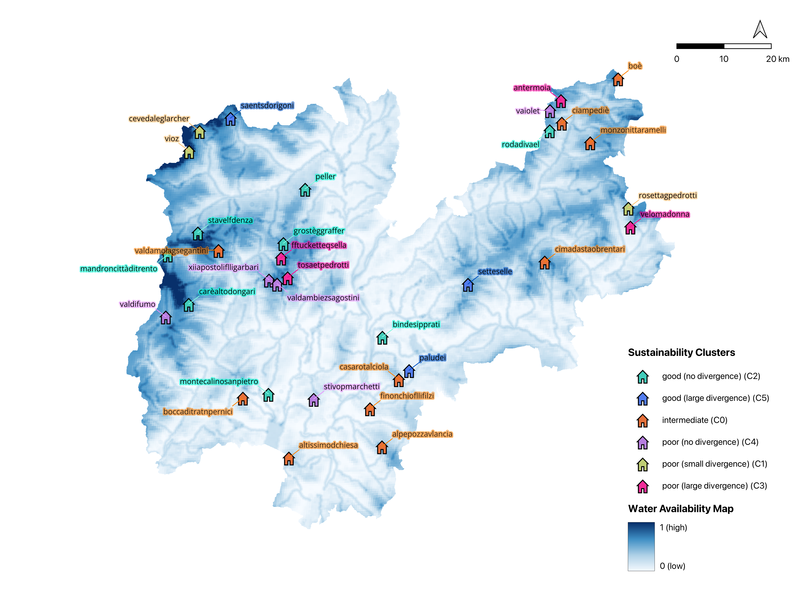

# Alpine Huts Sustainability
A Multi-Criteria Decision Making (MCDM) framework to calculate the environmental sustainability of mountain huts.

This repository serves as the comprehensive archive for the thesis project titled *"Sustainability Assessment of Mountain Huts: a GIS-Based Multi-Criteria Decision Analysis of SAT's Alpine Structures in Trentino"*. It contains all the essential elements required to understand, replicate, and build upon the work presented in the thesis.

Three MCDM methods (TOPSIS, VIKOR, PROMETHEE II) are tested to evaluate a group of 33 mountain huts based on the environmental sustainability of their operational equipment. Spatial MCDM is employed to aggregate raster maps of natural water resources into a single 50m resolution *Water Availability Map* expressing the amount of natural water resources available within the study area (Trentino, Italy). 

### Repository Structure
- `code/`: scripts used for data download, analysis, application of Multi-Criteria Decision-Making (MCDM) methods, and visualization of results.
- `data/`: datasets used throughout the research, including raw data collected from various sources, pre-processed data, and outputs generated during the analysis. *Not included*: large datasets (download using scripts) and private archival data. 
- `docs/`: explanations of the MCDM methodology, selected criteria and theoretical background references.
- `results/`: output files containing results, used for plots and maps.

### Findings
Practical findings consist in the identification of six clusters of huts based on their sustainability rank. For a comprehensive overview they are plotted on the Water Availability Map. Regional patterns related to water scarcity emerged, in particular for huts in dolomitic limestone areas. 

### Objectives of the Repository
- To provide transparency in the research process by making the code, data, and documentation accessible.
- To enable replication of the analysis and encourage further research in sustainability assessments, particularly in the context of mountain huts.
- To contribute to the academic and practical understanding of sustainable tourism and the integration of spatially driven methods in decision-making processes.

### Usage
This repository is intended for researchers, decision-makers, and practitioners in the fields of environmental management and alpine resource planning. By following the documentation provided, users can adapt the methodologies for similar sustainability assessments in different contexts.

For inquiries or collaboration opportunities, please contact the author via the provided communication channels.
